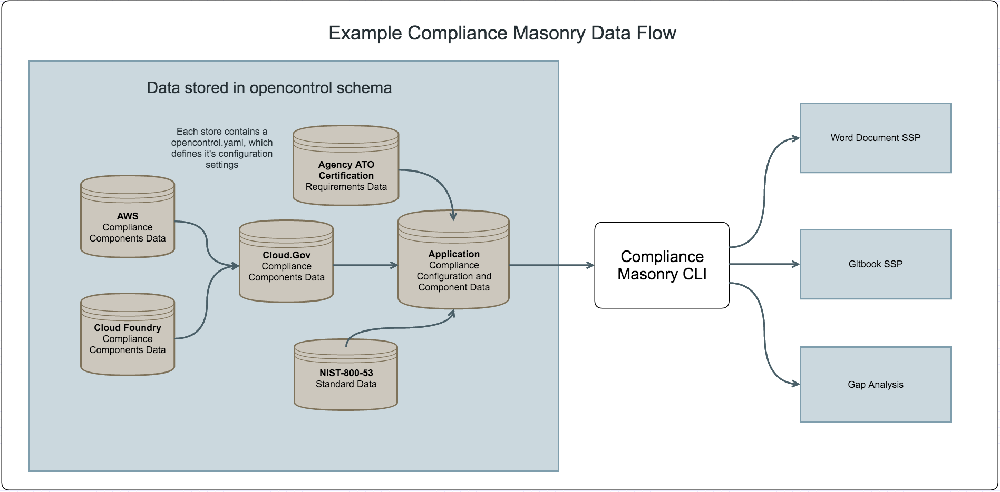

To learn about Compliance Masonry at a high level:

* [18F blog post about Compliance Masonry](https://18f.gsa.gov/2016/04/15/compliance-masonry-buildling-a-risk-management-platform/)
* [Compliance Masonry for the Compliance Literate](masonry-for-the-compliance-literate.md)

## Benefits

Modern applications are built on existing systems such as S3, EC2, and Cloud Foundry. Documentation for how these underlying systems fulfill NIST controls or PCI SSC Data Security Standards is a prerequisite for receiving authorization to operate (ATO). Unlike most [System Security Plan documentation](http://csrc.nist.gov/publications/nistpubs/800-18-Rev1/sp800-18-Rev1-final.pdf), Compliance Masonry documentation is built using [OpenControl Schema](https://github.com/opencontrol/schemas), a machine readable format for storing compliance documentation.

Compliance Masonry simplifies the process of certification documentations by providing:

1. a data store for certifications (ex FISMA), standards (ex NIST-800-53), and the individual system components (ex AWS-EC2).
1. a way for government project to edit existing files and also add new control files for their applications and organizations.
1. a pipeline for generating clean and standardized certification documentation.

## Examples

See [this list of OpenControl project examples](https://github.com/opencontrol/schemas/#full-project-examples).
